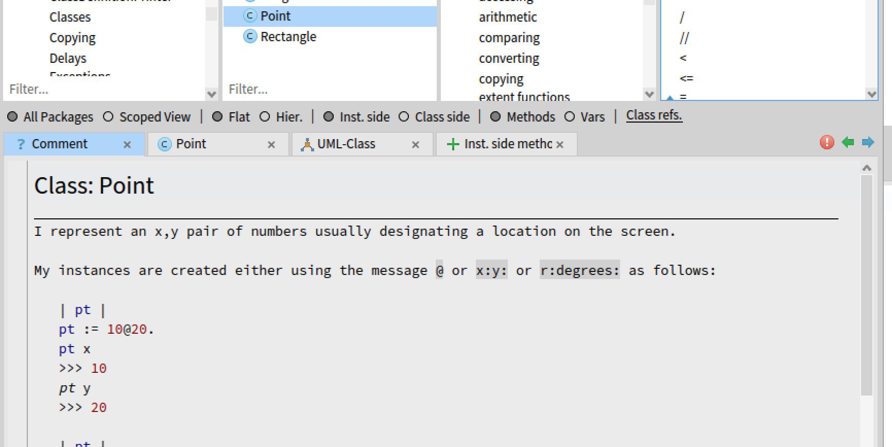
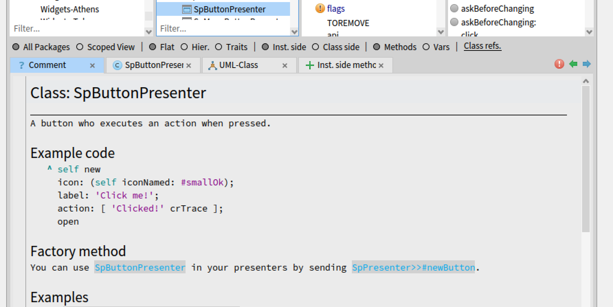
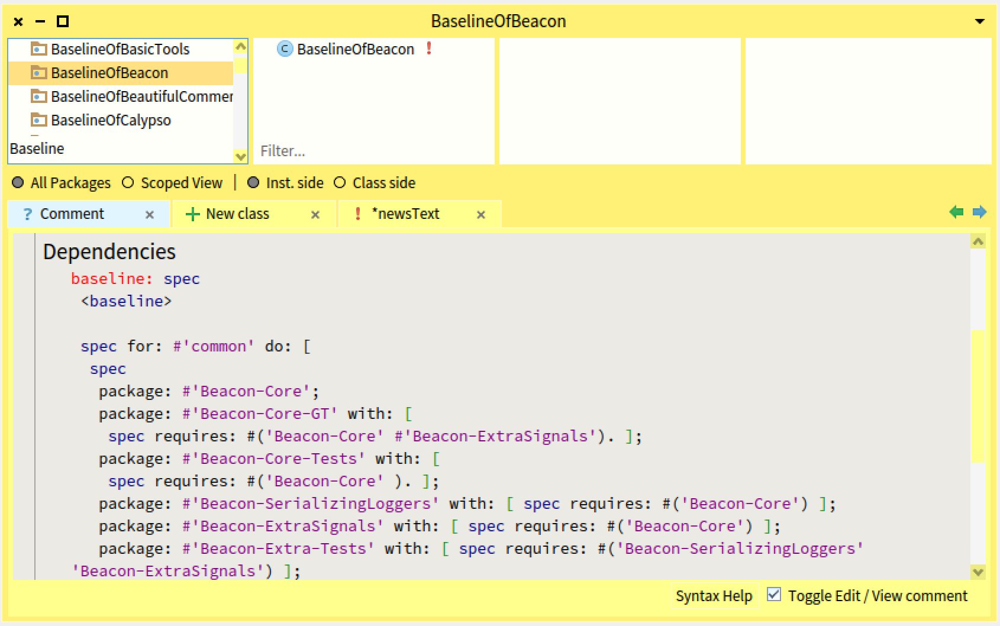

{ 
"title" : "Builder API variations",
"subtitle" : "",
"slidesid" : "M7-7" 
} 
 
 
# Goal 
- Discuss about builder API 
- Identify and understand variations 
 
# Microdown 
A better markdown :\) 
- compact \(a subset of markdown\) 
- more extensible \(a superset of markdown\) 
Used for: 
- class comments 
- slides, books, and documentation 
 
# Example 
 
``` 
# Hello Pharo

Microdown is a cool markdown.
It is used to generate
- slides
- books
- class comments


<!slide|title=This is a cool title&tag=nh5p

- a list of bullet
- bullet 2
- bullet 3
!> 
``` 
 
# Default Microdown class comment 
 
# Specialized Microdown class comment 
 
# Specialized Microdown class comment 
 
# How to programmatically generate Microdown? 
**No** string concatenation: 
- Expose users to possible syntax changes 
- Tool builders do not have to learn syntactic quirks 
Better provide a **scripting API** 
- **Abstract away** details 
- Support **future changes** 
**Hooks/Extensibility** 
- Every single class can **customize** \`buildMicroDownUsing: aBuilder withComment: aString\` hook 
 
# Microdown class comment hook 
 
``` 
renderComment: aString of: aClassOrPackage 
	"Return aString as part of the templated class comment, when rendering is on.
	Else aString."

	| builder |
	builder := Microdown builder.
	aClassOrPackage buildMicroDownUsing: builder withComment: aString.
	^ self render: builder contents 
``` 
 
# Default class comments 
 
``` 
Class >> buildMicroDownUsing: aBuilder withComment: aString
	
	aBuilder 
		header: [ 
				aBuilder text: 'Class: '.
				aBuilder text: self name ] 
		withLevel: 1;
			horizontalLine;
			text: aString 
``` 
 
# Hook for widgets 
 
``` 
SpAbstractWidget >> buildMicroDownUsing: aBuilder withComment: aString
	
	super buildMicroDownUsing: aBuilder withComment: aString.
	self addDocumentSectionExampleCode: aBuilder.
	self addDocumentSectionFactoryMethod: aBuilder.
	self documentSections keysAndValuesDo: [ :label :methods |
			self addDocumentSection: aBuilder label: label methods: methods ].
	self addDocumentExtraSections: aBuilder.
	self addDocumentSectionHierarchy: aBuilder.
	self addDocumentSectionTransmissions: aBuilder.	 
``` 
	 
# Hook for widgets (2) 
 
``` 
BaselineOf >> addDocumentSection: aBuilder label: label methods: methods
	
	methods ifEmpty: [ ^ self ].
	aBuilder newLine.
	aBuilder header: [ :builder | builder text: label ] withLevel: 2.
	aBuilder unorderedListDuring: [  
		(methods sorted: #selector ascending) do: [ :each |
			aBuilder item: [
				aBuilder monospace: (each methodClass name, '>>#', each selector) ] ] ] 
``` 
 
# About builder API 
All microdown elements and their parametrization 
- `text:`, `bold:`, `anchor:`, `codeblock:`,  
- `comment:` 
- `item`... 
 
# About generation of leaf elements 
For leaves, i.e., unstructured text or elements 
- Just pass the argument 
- Give simple order 
 
``` 
builder text: 'Bold' 
``` 
 
``` 
aBuilder newLine 
``` 
 
# Codeblock is also a leaf element 
 
``` 
	aBuilder codeblock: 
'this is the contents
of a code block.
It will be displayed with ``` around.' 
``` 
 
# About generation of composite/nested elements 
- Should provide a way to let the user defines the **inner** part 
- Use blocks as a way to support element wrapping 
 
``` 
builder bold: [ builder text: 'This is a text in bold' ] 
``` 
 
``` 
builder bold: [ builder italic: [ builder text: 'This is a text in bold and italic' ]] 
``` 
 
``` 
builder 
	header: [ 
		builder bold: [ builder text: 'Very']. 
		builder text: 'Important' ] 
	withLevel: 2. 
``` 
 
# Composite example: Cell 
 
``` 
testCell

	self
		assert: (builder
			cell: [ 
				builder text: 'this is '.
				builder bold: [ builder text: 'bold' ] ]) contents
		equals: '| this is **bold** ' 
``` 
 
# Comparing alternate designs 
What is the difference between  
``` 
aBuilder header: [ :builder | builder text: 'Factory method' ] withLevel: 2. 
``` 
And 
``` 
aBuilder header: [ aBuilder text: 'Factory method' ] withLevel: 2. 
``` 
 
# No parameter design 
 
``` 
aBuilder header: [ aBuilder text: 'Factory method' ] withLevel: 2. 
``` 
- Only one builder for all the messages 
- More compact 
 
# No parameter  implementation 
 
``` 
MicrodownTextualBuilder >> bold: aBlock
	self raw: BoldMarkup.
	aBlock value.
	self raw: BoldMarkup. 
``` 
- The builder executes the block `aBlock value` 
- Implications: there is only one builder \(the message receiver/method argument\) 
 
# With block parameter design 
 
``` 
aBuilder header: [ :builder | builder text: 'Factory method' ] withLevel: 2. 
``` 
- Each API can have its owns builder  
- We can have a hierarchy of builders, each one representing a finer context 
- More verbose 
 
# With block parameter implementation 
 
``` 
rawHeader: aBloc withLevel: anInteger
	self raw: (HeaderMarkup repeat: anInteger).
	self raw: String space.
	aBloc value: SpecialMicrodownBuilder new 
``` 
Each subclass can specialize `rawHeader: aBloc withLevel: anInteger`  
- or any other equivalent hook to use a specific builder. It is passed as argument of `value:` 
 
# Analysis 
**Pros:** 
- With an explicit argument builder, we can also subclass the builder and modify partially the builder behavior 
  - We could have a specialisation builder that produces the table of contents 
- It feels like visitor hooks 
**Cons:** 
- You have to define an extra parameter for all the wrapping APIs 
 
# Conclusion 
- Design is about tradeoffs 
- Extensibility can be designed 
