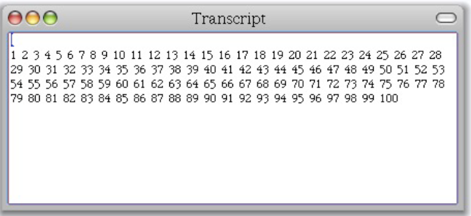
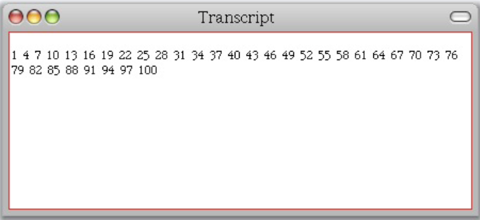

{
"title" : "Loops",
"subtitle" : "",
"slidesid" : "W2S07"
}

# Loops
- Loops are expressed as messages
- Many different ones
  - Plain loops
  - Conditional loops
- Messages sent to numbers, collections or blocks
- Iterators

# Loops: timesRepeat:
To repeat a given number of times an action
```
	4 timesRepeat: [ self doSomething ]
```

# Loops: to:do:

```
1 to: 100 do:
    [ :i | ... i ... ]
```
`to:do:` is a method defined on `Number`
# Example: to:do:
The block is executed with the temporary `i` taking values from 1 to 100
 
```
1 to: 100 do:
    [ :i | Transcript show: i ; space ]
```

# Loops: to:by:do:

```
    0 to: 100 by: 3 do: [ :i | ... i ... ]
```
`to:by:do:` is also a method defined on `Number`
# Example: to:by:do:
The block is executed with i taking values from 1 to 100 by step of 3
```
1 to: 100 by: 3 do:
    [ :i | Transcript show: i ; space ]
```

# Basic Iterators Overview
- `do:` \(iterate\)
- `collect:` \(iterate and collect results\)
- `select:` \(select matching elements\)
- `reject:` \(reject matching elements\)
- `detect:` \(get first element matching\)
- `detect:ifNone:` \(get first element matching or a default value\)
- `includes:` \(test inclusion\)
- and a lot more...

# Loops: do:

```
    aCol do: [ :each | ... ]
```
The block is executed with `each` taking as value all the elements of `aCol`
# Example: The iterator do:

```
#(15 10 19 68) do:  
      [:i | Transcript show: i ; cr ]
```

# Loops: whileTrue:

```
    [ ... ] whileTrue: [ ... ]
```
Executes the argument, `aBlock`, as long as the value of the receiver is true 
```
Color >> atLeastAsLuminentAs: aFloat 
  | revisedColor |
  revisedColor := self.
  [ revisedColor luminance < aFloat ] 
     whileTrue: [ revisedColor := revisedColor slightlyLighter ].
  ^ revisedColor
```

# Loops: whileTrue
Executes the receiver, as long as its value is true
```
    [ ... ] whileTrue
```
Equivalent with `whileFalse` and `whileFalse:`
# Summary
- Loops are expressed as messages
- Many different ones
  - Plain loops
  - Conditional loops
- Messages sent to numbers, collections or blocks
- Iterators
